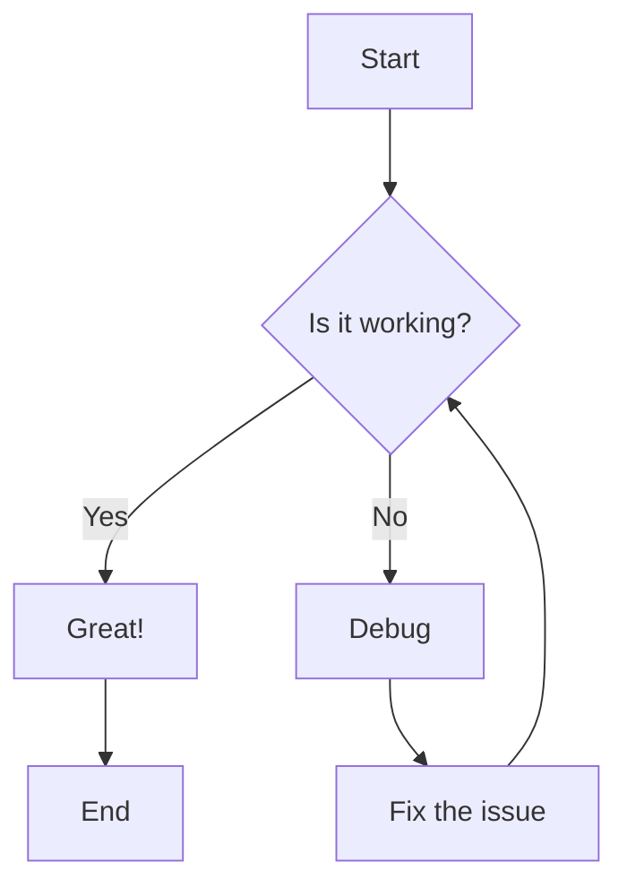
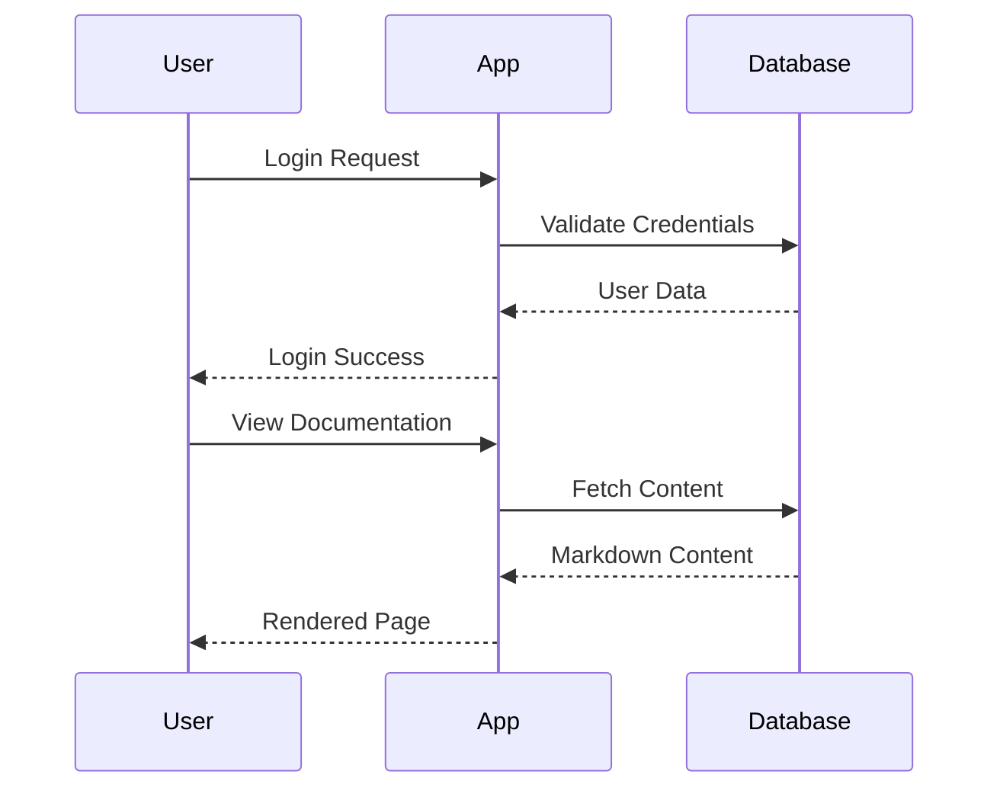
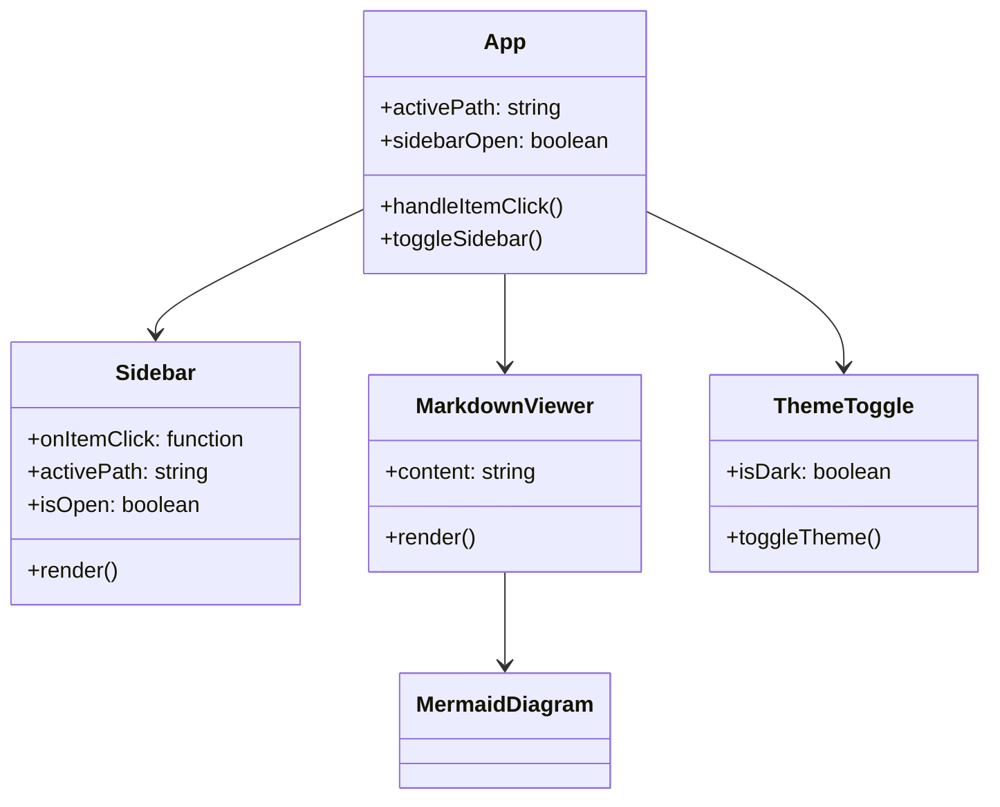
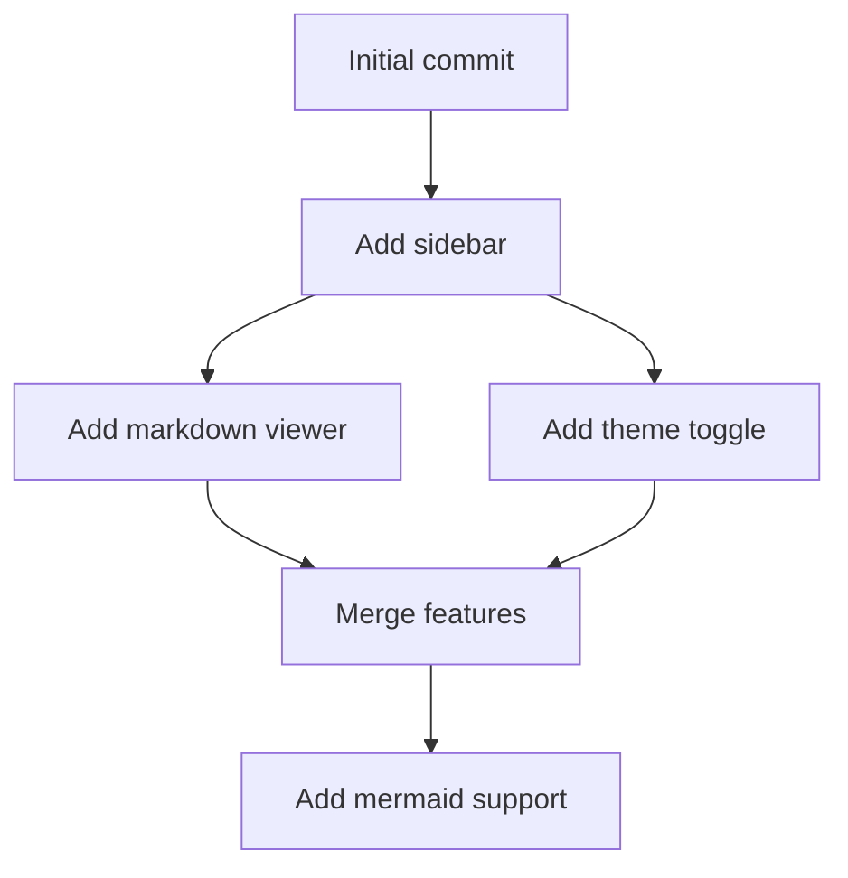
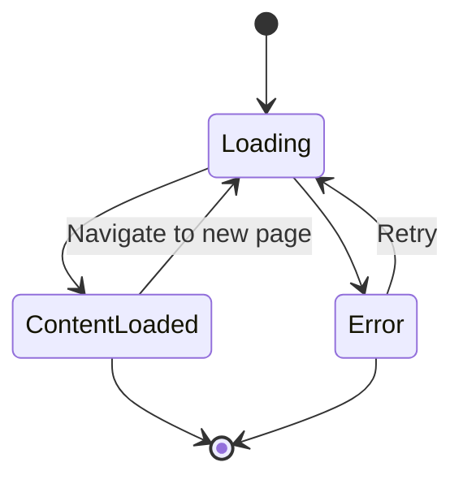
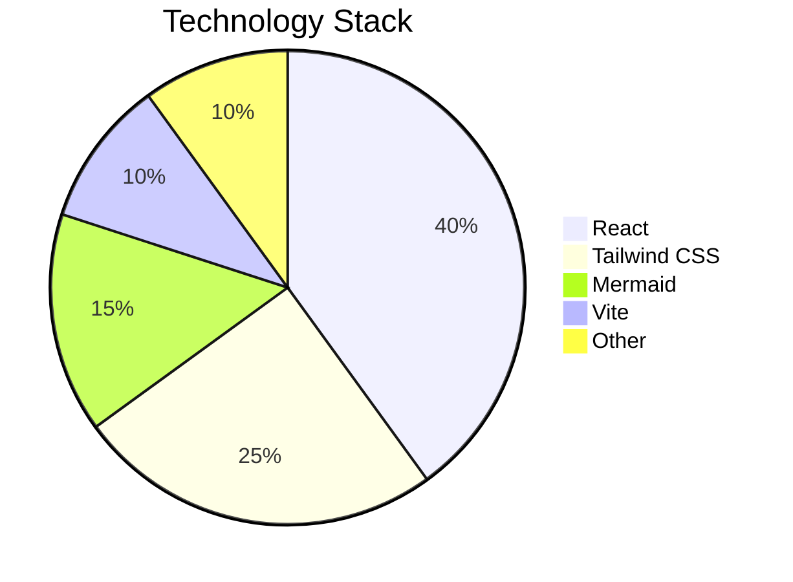
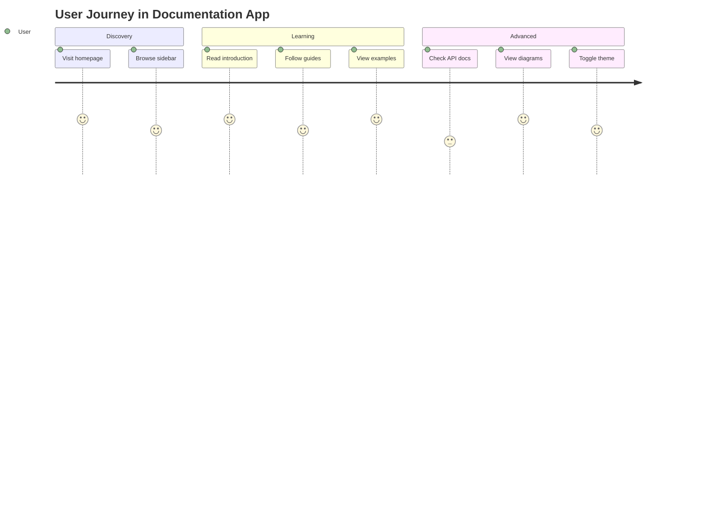
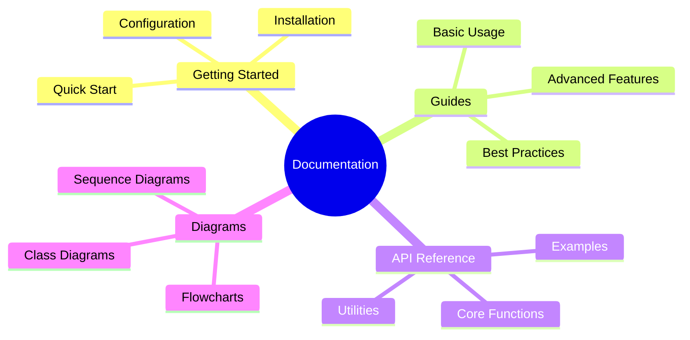
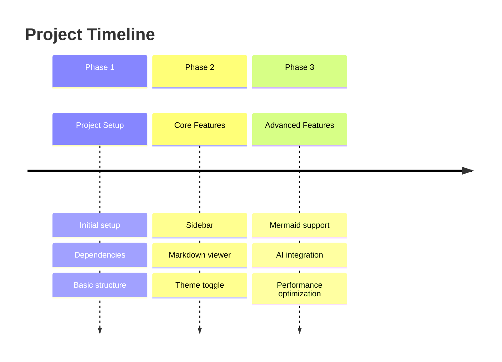
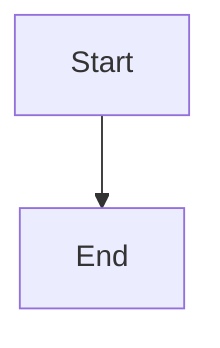

# Mermaid Diagrams

This page demonstrates various Mermaid diagrams that can be used in documentation.

## Flowchart

Here's a simple flowchart showing a basic process:



## Sequence Diagram

A sequence diagram showing user interaction:



## Class Diagram

A class diagram showing the application structure:



## Git Graph

A git graph showing project history:



## State Diagram

A state diagram showing the application states:



## Pie Chart

A pie chart showing technology usage:



## Gantt Chart

A Gantt chart showing project timeline:

```mermaid
gantt
    title Documentation App Development
    dateFormat  YYYY-MM-DD
    section Setup
    Project Setup           :done, setup, 2024-01-01, 1d
    Dependencies           :done, deps, after setup, 1d
    section Core Features
    Sidebar Component      :done, sidebar, after deps, 2d
    Markdown Viewer        :done, viewer, after sidebar, 2d
    Theme Toggle           :done, theme, after viewer, 1d
    section Advanced
    Mermaid Support        :active, mermaid, after theme, 2d
    AI Integration         :future, ai, after mermaid, 5d
```

## Journey Diagram

A user journey diagram:



## Mindmap

A mindmap showing the documentation structure:



## Timeline

A timeline showing project milestones:



## Usage

To add Mermaid diagrams to your markdown content, simply wrap your Mermaid code in a code block with the `mermaid` language identifier:

````markdown

````

The diagrams will automatically render with the appropriate theme (light/dark) based on the current theme setting.

## Supported Diagram Types

- **Flowcharts**: Process flows and decision trees
- **Sequence Diagrams**: Interaction between components
- **Class Diagrams**: Object-oriented design
- **State Diagrams**: System states and transitions
- **Entity Relationship Diagrams**: Database design
- **User Journey**: User experience flows
- **Gantt Charts**: Project timelines
- **Pie Charts**: Data visualization
- **Git Graphs**: Version control history
- **Mindmaps**: Hierarchical information
- **Timelines**: Chronological events

## Tips

1. **Keep diagrams simple**: Complex diagrams can be hard to read
2. **Use meaningful labels**: Clear, descriptive text improves understanding
3. **Test in both themes**: Ensure diagrams look good in light and dark modes
4. **Update regularly**: Keep diagrams in sync with your actual implementation
